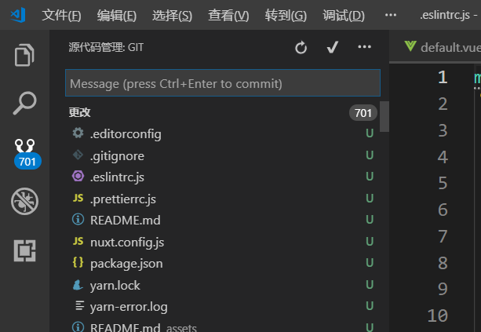
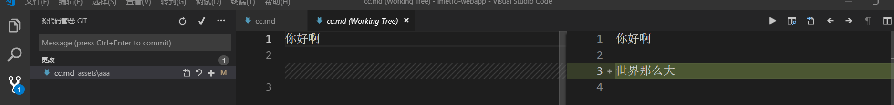

# vs code 使用

### 快捷键

* **Ctrl+Shift+P ：**打开控制面板  ，控制面板具有检索功能；
* **Ctrl+左键**：跳至单词首；
* **Ctrl+右键**：跳至单词尾；
* **Ctrl+上键**：跳至首行；
* **Ctrl+下键**：跳至尾行；
* **Home 键 +左键**：跳至行首；
* **Home 键 +左键**：跳至行尾；
* **Ctrl + Shift + \ **：花括号之间跳转；
* **左方向键+ Shift  **：单个字母选中；
* **Ctrl+ Shift +左方向键**：整个单词选中；
* **Ctrl+ Shift +左方向键**：此行到另外一行对应位置选中；
* **Ctrl + Shift + K** ：删除选中目标；
* **Alt + 上下方向键 **：移动代码；
* **Alt + shift +上下方向键** ：移动复制；
* **Ctrl + / **： 给代码添加注释；
* **Alt + Shift + F**：格式化文章；
* **Ctrl + K Ctrl + F** ：格式化选中代码；
* **Ctrl + U** ：撤销；
* **Ctrl + D**： 选中光标附近与之相同的单词；
* **Alt+鼠标左键**：定义多个光标（同时可以写多行重复的代码）；
* **Alt + Shift + i **：在选中内容的每行后都添加一个新的光标；
* **Ctrl+Tab **：打开页之间跳转；
* **Ctrl + P **：搜索跳转文件；
* **Ctrl + g **：行数搜索跳转；

* **Ctrl + F12 **：跳转到函数的实现的位置 ；
* **F12**：跳转到函数的定义处 ；
* **Shift + F12** ：引用跳转 ；
* **Ctrl+f**：局部搜索；
* **Ctrl+Shift +f**：全局搜索；
* **Ctrl + H**：局部替换；
* **Ctrl +Shift+ H**：全局替换；
* **Ctrl + `  **：开启/隐藏终端

### 鼠标

* **单击鼠标左键**：可以把光标移动到相应的位置；
* **双击鼠标左键**：将当前光标下的单词选中；
* **连续三击鼠标左键**：选中当前这一行代码；
* **连续四击鼠标左键**：选中整个文档 ；
* **单击行号 **：选中这一行 ；
* **行号上按下鼠标，上下移动 **：选中多行代码 ；
* **鼠标移至选中代码，左键不松 ，移动**：实习拖放功能 （相当于剪切粘贴）；
* **Ctrl +鼠标移至选中代码，左键不松 ，移动**：实现复制粘贴功能；
* **按下鼠标中键，选择区域**：区域内代码，每行拥有独立光标 ；
* **Ctrl+鼠标左键**：悬浮窗内容查看（很有用的功能）；

### 配置文件

* **editor.lineNumbers **：控制行号显示 ；
* **editor.renderWhitespace **：空格处用原点表示；
* **editor.renderIndentGuides **：缩进参考线；
* **editor.rulers **：垂直标尺；
* **editor.detectIndentation **：关闭自动检测来控制制表符或者空格键的使用 ；
* **editor.insertSpaces **：选择空格或者制表符 ；
* **editor.tabSize** ：制表符所对应的空格符的长度 
* **editor.formatOnSave:true** ：代码保存后统一格式化；
* **editor cursor**： 是跟光标渲染和多光标相关的设置；
* **editor fnd**： 是与编辑器内搜索相关的设置；
* **editor font**： 是与字体有关的设置；
* **editor format**： 是代码格式化；
* **editor suggest**： 是和自动补全、建议窗口等相关的配置。 
* **terminal.integrated.shell.windows**：配置window下的shell路径（你需要做的就是将需要的路径填写进去，例如我将git配置为我的默认的shell：`"terminal.integrated.shell.windows": "C:\\Program Files\\Git\\bin\\bash.exe"`）

### .vscode 文件夹

为了和其他工具添加的配置文件区分开， VS Code 的配置文件都会放在一个子文件夹 .vscode 中 。.vscode文件夹中有以下几种文件：

* **配置文件（settings.json）**：这个文件的作用和格式，跟我们之前修改的用户设置几乎是完全一样的。唯一的区别就在于这个文件的设置，只有当前这个文件夹在VS Code 中被打开时才会生效。 
* **调试设置（launch.json）**：它是用于说明如何调试当前文件夹下的代码 。
* **任务设置（tasks.json）**：它是关于 VS Code 任务系统的配置文件。把它们放在文件夹中甚至一并放入到代码仓库中，这样任何使用这个项目的工程师，都不用学习如何配置调试和配置任务系统就能运行代码了。

### 版本管理（源代码管理）

按下 Ctrl + Shift + G 快捷键，就能够打开版本管理视图 ，如图：

图中数字 701 代表的是更改后还没有提交的数量；

我们可以通过`git add ${fileName} `将文件放到暂存区，也可以用图标`+`，去添加。这些都是git的基本操作，如果不会请查看git。在我看来他最适用功能是当我们点击某个代码改动项时， VS Code 则会打开一个差异编辑器（diff editor ）。这个编辑器显示了这次代码改动之前和之后对应的文件内容。这样我们就能够很清楚地分辨出对哪些代码做了改动。 

每次在提交之前看下还是很有必要的；对于上面很多按钮的作用，就不再细说，鼠标悬停至其上就会有提示。

***

**END**

