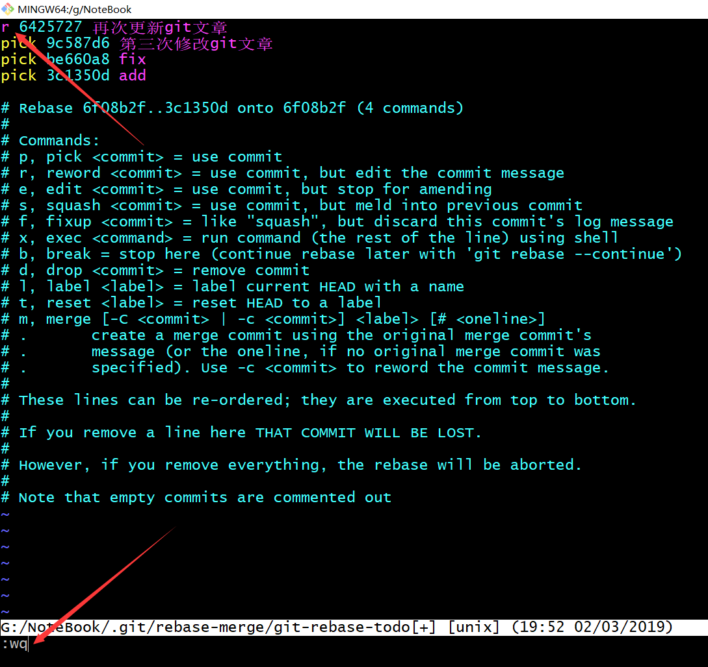

## git 常用命令

* **Git配置**

  系统配置：`git config  --system [配置内容] `  （作用于本操作系统，配置文件位于/etc/gitconfig）

  用户配置：`git config  --global  [配置内容]`（作用于本用户,配置文件位于用户目录./.gitconfig）

  项目配置：`git config [配置内容]` (作用于本项目，配置文件位于用项目./git/config)

  **例子**

  ```git
   git config --global user.name "John Doe"
   git config --global user.email johndoe@example.com
  ```

  **查看配置信息**

  ```git 
   git config --list
  ```

* **初始化Git仓库**

  进入你要用Git管理的仓库，执行下面的命令：

  ```git
  git init
  ```

  仓库初始化完成后会生成.git文件，里面记录了你的数据和资源。

* **ADD: 将文件提交到暂存区**

  全部提交

  ```git
  git add .
  ```

  提交指定文件

  ```git
  git add [提交文件]
  ```

* **commit：将暂存区的文件提交到本地仓库**

  ```git
   git commit -m "本次提交备注的信息"
  ```

  备注信息非常重要，可以让你看日志的时候知道具体那次的提交做了什么事。

  如果备注信息出错可以这样修改：

  ```git
  # 最近一次的备注信息修改
  git commit --amend
  
  # 多版本前的备注信息修改可以通过变基实现
  ```

* **变基**

  ```git
  git rebase -i [要修改版本的父版本号]
  ```

  你会得到下面内容(我的例子）：

  ```shell
  pick 6425727 再次更新git文章
  pick 9c587d6 第三次修改git文章
  pick be660a8 fix
  
  # Rebase 6f08b2f..be660a8 onto 6f08b2f (3 commands)
  #
  # Commands:
  # p, pick <commit> = use commit
  # r, reword <commit> = use commit, but edit the commit message
  # e, edit <commit> = use commit, but stop for amending
  # s, squash <commit> = use commit, but meld into previous commit
  # f, fixup <commit> = like "squash", but discard this commit's log message
  # x, exec <command> = run command (the rest of the line) using shell
  # b, break = stop here (continue rebase later with 'git rebase --continue')
  # d, drop <commit> = remove commit
  # l, label <label> = label current HEAD with a name
  # t, reset <label> = reset HEAD to a label
  # m, merge [-C <commit> | -c <commit>] <label> [# <oneline>]
  # .       create a merge commit using the original merge commit's
  # .       message (or the oneline, if no original merge commit was
  # .       specified). Use -c <commit> to reword the commit message.
  #
  # These lines can be re-ordered; they are executed from top to bottom.
  #
  # If you remove a line here THAT COMMIT WILL BE LOST.
  #
  # However, if you remove everything, the rebase will be aborted.
  #
  # Note that empty commits are commented out
  
  ```

  因为我需要对备注信息修改，所以不能选择pick命令，选择第二项 `reword`,其他命令有相应的解释，自己查看；

  

  保存后，会弹出需要修改的文件，修改保存即可；

* **配置忽略文件**

  在项目中有些文件是不需要提交到代码仓库的，我们可以通过配置`.gitignore`文件来忽略他们，如果没有该文件可以自己创建。

  `.gitignore`文件样例：

  ```shell
  # 忽略所有 .a 结尾的文件
  *.a
  
  # 但lib.a 除外
  !lib.a
  
  # 仅仅忽略项目根目录下的 TODO 文件，不包括 subdir/TODO
  /TODO
  
  # 忽略 build/ 目录下的所有文件
  build/
  
  # 会忽略 doc/notes.txt 但不包括 doc/server/arch.txt
  doc/*.txt
  
  # 忽略 doc/ 目录下所有扩展名为 txt 的文件
  doc/**/*.txt
  ```

* **克隆文件**

  ```git
  git clone [文件地址] [本地仓库名]
  ```

* **状态检查**

  ```git
  git status
  ```

* **差异对比**

  对比本地工作区和暂存区之间的差异

  ```git
  git diff 
  ```

  对比暂存区和上次提交版本之间的差异

  ```git
  git diff --cached
  ```

  对比两个版本之间的差异

  ```git
  git diff [版本1] [版本2]
  
  # 此版本和上一版本比较
  git diff HEAD HEAD^
  ```

* **HEAD**

  表示当前版本的指向，上一版本可以`HEAD^`或`HEAD~1`；

* **移除文件**

  ```git
  git rm [移除文件]
  ```

* **移动文件**

  ```git
  git mv [源文件] [目标地址]
  ```

* **日志查询**

  ```git
   # 当分支版本
   git log
   
   # 日志简略信息
   git log --oneline
  
   #限制查询数量
   git log -n[数字]
   
   # 所有分支版本日志
   git log -all 
   
   #版本演变历史图形化展示
   git log --all --graph
  ```


* **文件名重命名**

  ```git
   git mv [oldName] [newName]
  ```

* **创建分支**

  ```git
   git checkout -b [分支名] [基于的版本（省略为当前分支）]
  ```

* **分支查询**

  ```git
    git branch -v
  ```

* **删除分支**

  ```git
  git branch -d [分支名]
  ```

  

### Git会遇到的问题

*  **分离头指针（detached HEAD)**： 指的是没有把头指针和分支绑定到一起，会造成分支切换后，数据丢失；根据提示创建新的分支就可以解决。