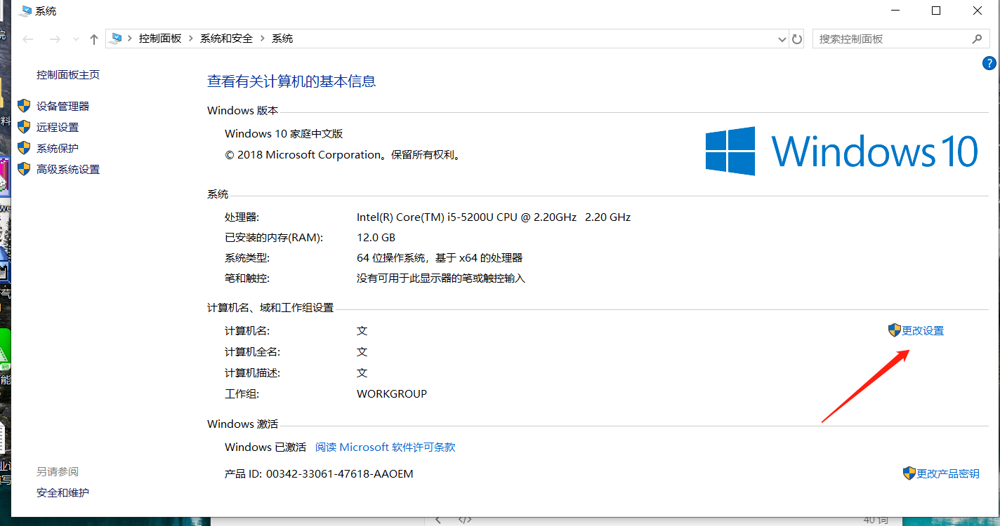
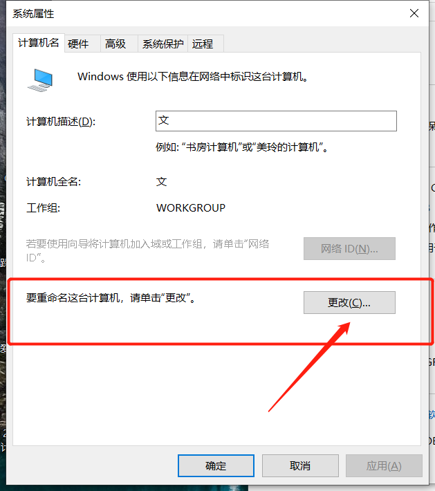
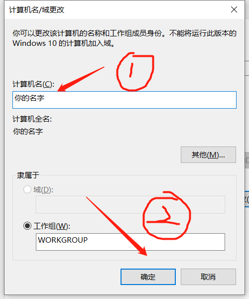
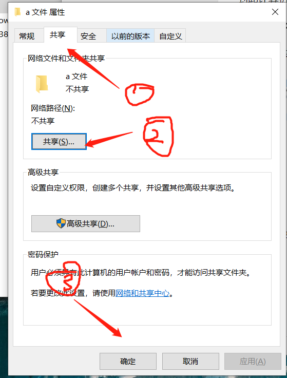
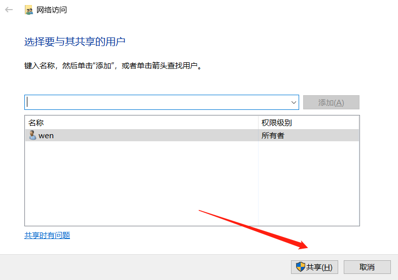
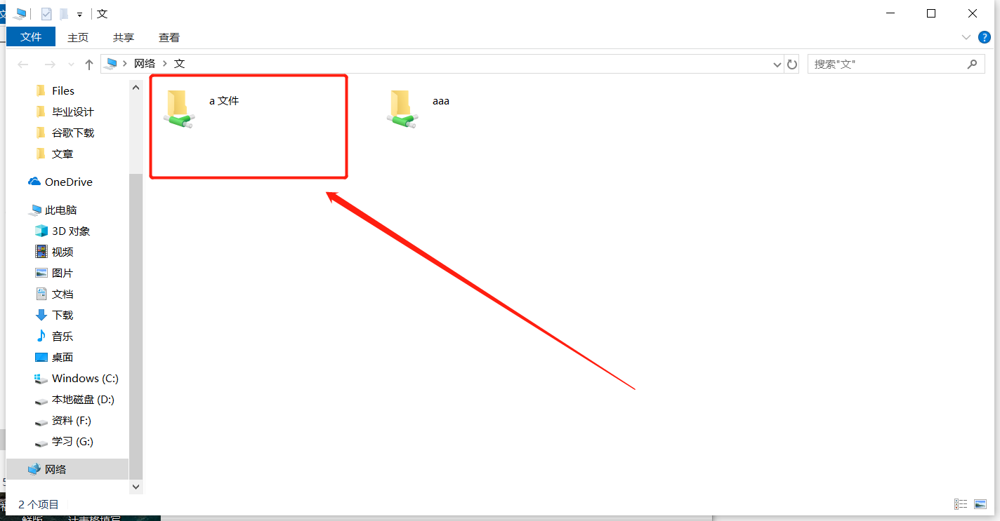

#### 配置计算机名称——让同一网络下的人更好识别你

计算机 =》右键 =》属性 

打开系统控制面板，选择更改设置，如下：

进入更改设置，选择重命名计算机名：

点击更改进入，在1处修改，确定，需要**重启计算机**。

到此计算机改名完毕。

#### 共享文件夹

找到需要共享的文件，右键 =》属性，选择共享：

在共享模块中选择共享：

点击2共享，然后进入下图共享：

共享成功后如图：

在 1 处，复制共享连接。

2 处，查看共享网络是否成功。

成功后返回。

共享文件结束。